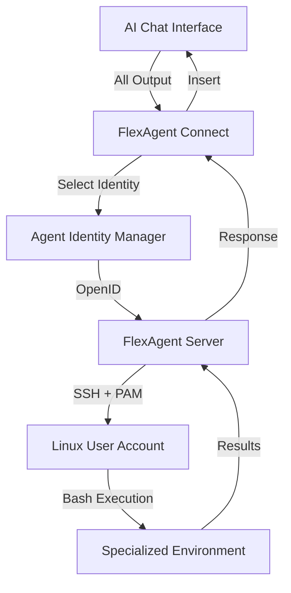

<div align="center">
   <h1>FlexAgent Connect</h1>
</div>

<p align="center">
Agent-centric browser extension for connecting AI platforms to FlexAgent servers
</p>

<div align="center">
 
</div>

## Overview

FlexAgent Connect is a browser extension that connects AI platforms like ChatGPT, Perplexity, Gemini, and more to FlexAgent servers through agent-centric identity management. Unlike traditional tool-centric approaches, FlexAgent Connect focuses on managing and selecting from multiple agent identities (OpenIDs) that correspond to specialized Linux user accounts on FlexAgent servers.

## Key Concept

FlexAgent Connect allows users to:
- **Manage Agent Identities**: Import, create, modify, and remove OpenIDs representing different specialized agents
- **Select Active Agent**: Choose from agents like "Gary the Perl Expert", "Bob the Ethicist", or "Jim the SQL Expert"
- **Seamless Integration**: Forward all LLM output (including tool calls) to the FlexAgent server and return responses directly to the AI platform

Each OpenID corresponds to a Linux user account on the FlexAgent server with specific permissions, home directory, and specialized tools/environment.

## Currently Supported Platforms

- [ChatGPT](https://chatgpt.com/)
- [Google Gemini](https://gemini.google.com/)
- [Perplexity](https://perplexity.ai/)
- [Grok](https://grok.com/)
- [Google AI Studio](https://aistudio.google.com/)
- [OpenRouter Chat](https://openrouter.ai/chat)
- [DeepSeek](https://chat.deepseek.com/)
- [T3 Chat](https://t3.chat/)
- [GitHub Copilot](https://github.com/copilot)
- [Mistral AI](https://chat.mistral.ai/)

## Architecture

FlexAgent Connect uses a modern, agent-centric architecture:

### Agent Identity Management
- **OpenID Registry**: Centralized management of agent identities
- **Identity Selection**: Quick switching between different agent personas
- **Server Integration**: Automatic registration of selected identity with FlexAgent server

### Core Components
- **Plugin System**: Modular architecture for different AI platforms
- **State Management**: Zustand-based state management for identity and connection state
- **Event System**: Real-time communication between components
- **Chrome Extension**: Manifest V3 compliant browser extension

### FlexAgent Server Integration
- **SSH Authentication**: OpenID-based SSH access to specialized Linux accounts
- **PAM Integration**: Secure authentication through PAM modules
- **Bash Tool**: Universal tool execution through secure bash interface
- **I/O Forwarding**: Seamless forwarding of LLM output and server responses



## Getting Started

### Installation

Install from browser stores:
- Chrome Web Store: [Coming Soon]
- Firefox Add-ons: [Coming Soon]

### Manual Installation (Development)

1. Clone the repository
```bash
git clone git@github.com:League-University/FlexAgent-Connect.git
cd FlexAgent-Connect
```

2. Install dependencies
```bash
pnpm install
```

3. Build the extension
```bash
pnpm build
```

4. Load in browser
- Navigate to `chrome://extensions/`
- Enable "Developer mode"
- Click "Load unpacked" and select the `dist` directory

### FlexAgent Server Setup

1. Set up your FlexAgent server (separate project)
2. Configure OpenID authentication
3. Create specialized user accounts for your agents
4. Connect FlexAgent Connect to your server

## Usage

1. **Open Extension**: Navigate to a supported AI platform
2. **Manage Identities**: Use the sidebar to add/manage your agent identities
3. **Select Agent**: Choose the appropriate agent for your task
4. **Interact**: Use the AI platform normally - all output is forwarded to your FlexAgent server
5. **View Results**: Server responses are automatically inserted into the conversation

## Agent Identity Examples

- **Gary the Perl Expert**: Linux account with Perl development environment, CPAN modules, and legacy system tools
- **Bob the Ethicist**: Account with ethics research databases, philosophical texts, and analysis tools
- **Jim the SQL Expert**: Account with database tools, sample datasets, and data science libraries
- **Alice the DevOps Engineer**: Account with cloud tools, monitoring systems, and deployment scripts

## Development

### Prerequisites

- Node.js (v22+)
- pnpm
- Chrome/Firefox for testing

### Setup

```bash
# Install dependencies
pnpm install

# Start development server
pnpm dev

# Build for production
pnpm build

# Run tests
pnpm test

# Lint code
pnpm lint
```

### Architecture Details

FlexAgent Connect is built on a modern plugin architecture:

- **Plugin System**: Extensible adapters for different AI platforms
- **State Management**: Zustand stores for agent identity and connection state
- **Event System**: Type-safe event communication
- **Chrome Extension**: Manifest V3 with service worker architecture

## Contributing

Contributions are welcome! This project is maintained by League University as part of the FlexAgent ecosystem.

1. Fork the repository
2. Create your feature branch (`git checkout -b feature/amazing-feature`)
3. Commit your changes (`git commit -m 'Add some amazing feature'`)
4. Push to the branch (`git push origin feature/amazing-feature`)
5. Open a Pull Request

## License

This project is licensed under the MIT License - see the LICENSE file for details.

## Acknowledgments

- **Original Project**: Forked from [MCP-SuperAssistant](https://github.com/srbhptl39/MCP-SuperAssistant) by srbhptl39
- **League University**: Current maintainer and copyright holder
- **Model Context Protocol**: Inspiration from Anthropic's MCP specification
- **Chrome Extension Boilerplate**: Built with React + Vite boilerplate

## Copyright Notice

```
Copyright (c) 2024 League University
Original work Copyright (c) 2024 MCP-SuperAssistant contributors

Permission is hereby granted, free of charge, to any person obtaining a copy
of this software and associated documentation files (the "Software"), to deal
in the Software without restriction, including without limitation the rights
to use, copy, modify, merge, publish, distribute, sublicense, and/or sell
copies of the Software, and to permit persons to whom the Software is
furnished to do so, subject to the following conditions:

The above copyright notice and this permission notice shall be included in all
copies or substantial portions of the Software.
```

---

**FlexAgent Connect** - Connecting AI platforms to specialized agent environments through identity-based server access.